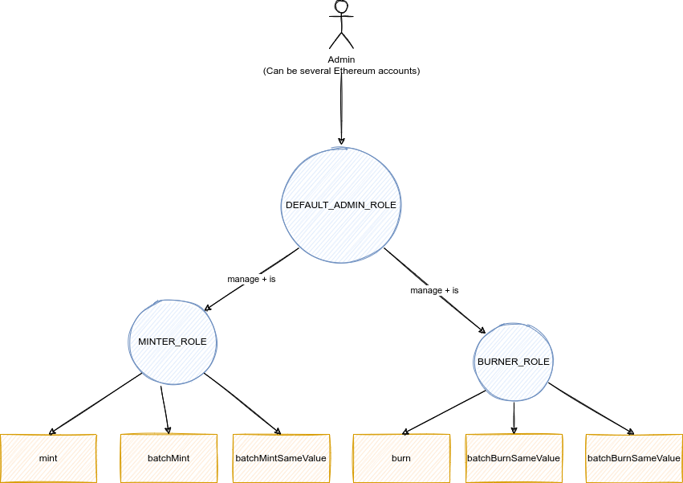
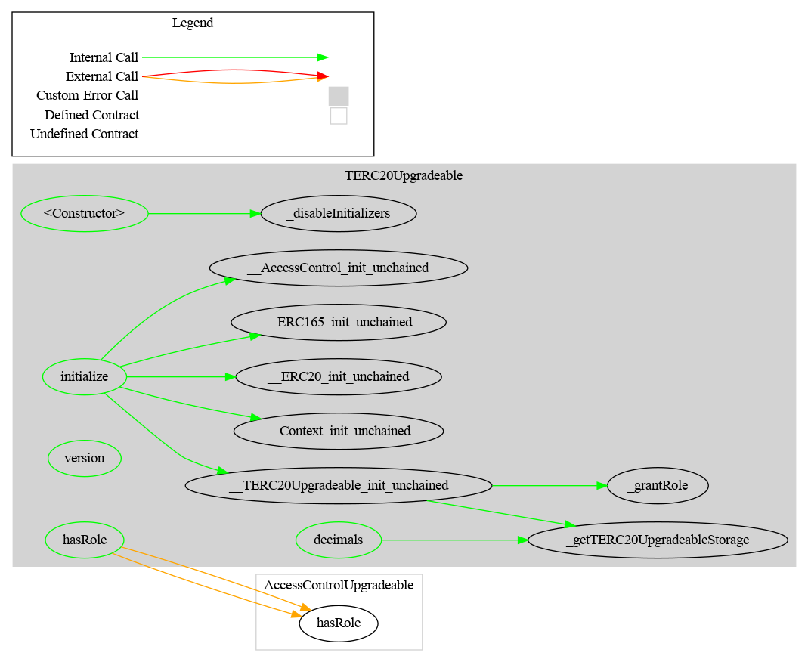

## TERC-20

[ERC-20](https://eips.ethereum.org/EIPS/eip-20) is the main standard to represent fungibles tokens on Ethereum and EVM blockchain. This ERC defines the functions, events and the behavior of a token implementing this interface.

One of the main libraries used to build ERC-20 is OpenZeppelin. This library provides already all functions which are part of the standard. Nevertheless, OpenZeppelin does not provide a deployable contract, but only an [abstract](https://docs.soliditylang.org/en/v0.8.28/contracts.html#abstract-contracts) contract which can be used to build other contracts though inheritance but cannot be deployed directly on the blockchain. You can find more information about their implementation in their [documentation](https://docs.openzeppelin.com/contracts/5.x/erc20). 

TERC-20 aims to provide a minimal deployable implementation for standalone deployment (immutable) and proxy deployment (upgradeable) which allows the issueur (and only him) to mint and burn tokens. 

TERC-20 exists in two different version: standalone and proxy:

- `TERC20Standalone` for an immutable deployment, without proxy.

See [./TERC20Standalone](./src/TERC20Standalone.sol)

- `TERC20Upgradeable` for an upgradeable deployment, with a compatible proxy (Transparent or Beacon)

See [./TERC20Upgradeable](./src/TERC20Upgradeable.sol)

## ERC

In addition to ERC-20, TERC-20 uses the following ERCs:

- [ERC-6093](https://eips.ethereum.org/EIPS/eip-6093): Custom errors for ERC-20 tokens (through OpenZeppelin)
- [eip-3643](https://eips.ethereum.org/EIPS/eip-3643): implements the following functions:
  - version()
  - mint(), burn()
  - batchMint, batchBurn()
- TERC20Upgradeable only: 
  - implements [ERC-7201](https://eips.ethereum.org/EIPS/eip-7201) to manage the storage location.

## Common features

These ERC-20 tokens have the following characteristics:

**Mint**

- A mint function only accessible with the MINTER role

- Two mint batch functions only accessible with the MINTER role

Interface defined in [./TERC20ShareMint](./src/lib/TERC20ShareMint.sol)

**Burn**

- A burn function only accessible with the BURNER role
- Two burn in batch functions only accessible with the BURNER role

Interface defined in [./TERC20ShareBurn](./src/lib/TERC20ShareBurn.sol)

**ERC20**

- At deployment, the issuer can set the name, symbol and decimals.

- Once deployed, it is no longer possible to modify these values except via an upgrade in the case of the proxy.

## Access control

Access Control is managed with the OpenZeppelin library [AccessControl](https://docs.openzeppelin.com/contracts/5.x/api/access#AccessControl) which implements a role-based access control mechanism.

- Default Admin Role

The most important role is the role `DEFAULT_ADMIN_ROLE`. This role manages all other roles.

This role is also its own admin: it has permission to grant and revoke this role. 

warning: Extra precautions should be taken to secure accounts that have been granted it.

- Supply management role

Two roles BURNER_ROLE and MINTER_ROLE allow their members to respectively mint or burn tokens.

### Schema




## Schema

### TERC20Standalone

#### Inheritance


#### Graph


### TERC20 Upgradeable

#### Inheritance


#### Graph



## Surya Description Report

### TERC20Standalone

|       Contract       |        Type        |               Bases               |                |               |
| :------------------: | :----------------: | :-------------------------------: | :------------: | :-----------: |
|          └           | **Function Name**  |          **Visibility**           | **Mutability** | **Modifiers** |
|                      |                    |                                   |                |               |
| **TERC20Standalone** |   Implementation   | ERC20, AccessControl, TERC20Share |                |               |
|          └           |   <Constructor>    |             Public ❗️              |       🛑        |     ERC20     |
|          └           |      decimals      |             Public ❗️              |                |      NO❗️      |
|          └           |      version       |             Public ❗️              |                |      NO❗️      |
|          └           |        mint        |             Public ❗️              |       🛑        |   onlyRole    |
|          └           |     batchMint      |             Public ❗️              |       🛑        |   onlyRole    |
|          └           | batchMintSameValue |             Public ❗️              |       🛑        |   onlyRole    |
|          └           |        burn        |             Public ❗️              |       🛑        |   onlyRole    |
|          └           |     batchBurn      |             Public ❗️              |       🛑        |   onlyRole    |
|          └           | batchBurnSameValue |             Public ❗️              |       🛑        |   onlyRole    |
|          └           |      hasRole       |             Public ❗️              |                |      NO❗️      |

### TERC20Upgradeable

|       Contract        |                Type                |                            Bases                             |                |                  |
| :-------------------: | :--------------------------------: | :----------------------------------------------------------: | :------------: | :--------------: |
|           └           |         **Function Name**          |                        **Visibility**                        | **Mutability** |  **Modifiers**   |
|                       |                                    |                                                              |                |                  |
| **TERC20Upgradeable** |           Implementation           | Initializable, ERC20Upgradeable, AccessControlUpgradeable, TERC20Share, TERC20UpgradeableBurn, TERC20UpgradeableMint |                |                  |
|           └           |           <Constructor>            |                           Public ❗️                           |       🛑        |       NO❗️        |
|           └           |             initialize             |                           Public ❗️                           |       🛑        |   initializer    |
|           └           | __TERC20Upgradeable_init_unchained |                          Internal 🔒                          |       🛑        | onlyInitializing |
|           └           |              decimals              |                           Public ❗️                           |                |       NO❗️        |
|           └           |              version               |                           Public ❗️                           |                |       NO❗️        |
|           └           |              hasRole               |                           Public ❗️                           |                |       NO❗️        |
|           └           |    _getTERC20UpgradeableStorage    |                          Private 🔐                           |                |                  |

#### TERC20UpgradeableMint

|         Contract          |        Type        |                            Bases                            |                |               |
| :-----------------------: | :----------------: | :---------------------------------------------------------: | :------------: | :-----------: |
|             └             | **Function Name**  |                       **Visibility**                        | **Mutability** | **Modifiers** |
|                           |                    |                                                             |                |               |
| **TERC20UpgradeableMint** |   Implementation   | ERC20Upgradeable, AccessControlUpgradeable, TERC20ShareMint |                |               |
|             └             |        mint        |                          Public ❗️                           |       🛑        |   onlyRole    |
|             └             |     batchMint      |                          Public ❗️                           |       🛑        |   onlyRole    |
|             └             | batchMintSameValue |                          Public ❗️                           |       🛑        |   onlyRole    |

#### TERC20UpgradeableBurn

|         Contract          |        Type        |                            Bases                            |                |               |
| :-----------------------: | :----------------: | :---------------------------------------------------------: | :------------: | :-----------: |
|             └             | **Function Name**  |                       **Visibility**                        | **Mutability** | **Modifiers** |
|                           |                    |                                                             |                |               |
| **TERC20UpgradeableBurn** |   Implementation   | ERC20Upgradeable, AccessControlUpgradeable, TERC20ShareBurn |                |               |
|             └             |        burn        |                          Public ❗️                           |       🛑        |   onlyRole    |
|             └             |     batchBurn      |                          Public ❗️                           |       🛑        |   onlyRole    |
|             └             | batchBurnSameValue |                          Public ❗️                           |       🛑        |   onlyRole    |

### Legend

| Symbol | Meaning                   |
| :----: | ------------------------- |
|   🛑    | Function can modify state |
|   💵    | Function is payable       |


## Dependencies

The toolchain includes the following components, where the versions are the latest ones that we tested:

- Foundry / forge 1.0.0-stable
- Solidity 0.8.28 (via solc-js)
- OpenZeppelin Contracts (submodule) [v5.2.0](https://github.com/OpenZeppelin/openzeppelin-contracts/releases/tag/v5.2.0)
- OpenZeppelin Contracts upgradeable (submodule) [v5.2.0](https://github.com/OpenZeppelin/openzeppelin-contracts/releases/tag/v5.2.0)

## Security and Audit

### Vulnerability disclosure

Please see [SECURITY.md](./SECURITY.md).

### Audit

see [report](doc/audit/SecfaultSecurity_Report_Review_ERC20_v1.0.pdf) made by [SecFault Security](https://secfault-security.com)

See our comment here [report file](./doc/audit/secfault-report.md)

### Audit tools

#### Slither

 [Report file](./doc/audit/tool/slither-report.md)

See [crytic/slither](https://github.com/crytic/slither)

```bash
slither .  --checklist --filter-paths "openzeppelin-contracts|test|forge-std" > slither-report.md
```

#### Mythril

 [Report file](./doc/audit/tool/mythril-report.md)

```bash
myth analyze src/TERC20Standalone.sol --solc-json solc_setting.json
```

See [Consensys/mythril](https://github.com/Consensys/mythril)

#### Cyfrin Aderyn

 [Report file](./doc/audit/tool/aderyn-report.md)

```
aderyn
```

See [Cyfrin/aderyn](https://github.com/Cyfrin/aderyn)

## Tools

### Surya

See [./doc/script](./doc/script) and [Consensys/surya](https://github.com/Consensys/surya)

### Prettier

```bash
npx prettier --write --plugin=prettier-plugin-solidity 'src/**/*.sol'
```

```bash
npx prettier --write --plugin=prettier-plugin-solidity 'test/**/*.sol'
```

### Foundry

Foundry is a blazing fast, portable and modular toolkit for Ethereum application development written in Rust.

Foundry consists of:

-   **Forge**: Ethereum testing framework (like Truffle, Hardhat and DappTools).
-   **Cast**: Swiss army knife for interacting with EVM smart contracts, sending transactions and getting chain data.
-   **Anvil**: Local Ethereum node, akin to Ganache, Hardhat Network.
-   **Chisel**: Fast, utilitarian, and verbose solidity REPL.

## Usage

*Explain how it works.*


### Toolchain installation

The contracts are developed and tested with [Foundry](https://book.getfoundry.sh), a smart contract development toolchain.

To install the Foundry suite, please refer to the official instructions in the [Foundry book](https://book.getfoundry.sh/getting-started/installation).

### Initialization

You must first initialize the submodules, with

```
forge install
```

See also the command's [documentation](https://book.getfoundry.sh/reference/forge/forge-install).

Later you can update all the submodules with:

```
forge update
```

See also the command's [documentation](https://book.getfoundry.sh/reference/forge/forge-update).

### Compilation

The official documentation is available in the Foundry [website](https://book.getfoundry.sh/reference/forge/build-commands) 

```
 forge build
```

### Testing

You can run the tests with

```
forge test
```

To run a specific test, use

```
forge test --match-contract <contract name> --match-test <function name>
```

See also the test framework's [official documentation](https://book.getfoundry.sh/forge/tests), and that of the [test commands](https://book.getfoundry.sh/reference/forge/test-commands).

### Coverage


* Perform a code coverage

```
forge coverage
```

* Generate LCOV report

```
forge coverage --report lcov
```

- Generate `index.html`

```bash
forge coverage --ffi --report lcov && genhtml lcov.info --branch-coverage --output-dir coverage 
```

See [Solidity Coverage in VS Code with Foundry](https://mirror.xyz/devanon.eth/RrDvKPnlD-pmpuW7hQeR5wWdVjklrpOgPCOA-PJkWFU) & [Foundry forge coverage](https://www.rareskills.io/post/foundry-forge-coverage)

### Documentation

[https://book.getfoundry.sh/](https://book.getfoundry.sh/)

## FAQ

> Can we put the smart contract in a pause state ?

No, it is not possible to put the contract in a pause state. However, to desactivate the contract, it is possible to burn all tokens and renounce the control on the smart contract. 

If you are interested by this feature, [CMTAT](https://github.com/CMTA/CMTAT) could be more suitable.

> Is the contracts compatible with [ERC-2771](https://eips.ethereum.org/EIPS/eip-2771) (gasless / MetaTx transaction)/

No, TERC-20 does not implement this ERC. If you are interested by this feature, [CMTAT](https://github.com/CMTA/CMTAT) could be more suitable.

> Can we change the symbol, name or decimals after deployment ?

In standalone deployment (immutable), all these information can not be changed.

With a proxy deployment, it is still possible to change it by deploying a new implementation which allows to set these information, but it requires extra work.

if you want the possibility to update these information, [CMTAT](https://github.com/CMTA/CMTAT) could be more suitable since it allows more flexibility.

## Intellectual property

The original code is copyright (c) Taurus 2025, and is released under [MIT license](https://github.com/taurushq-io/tg-bridge-contracts-CCIP/blob/main/LICENSE).
