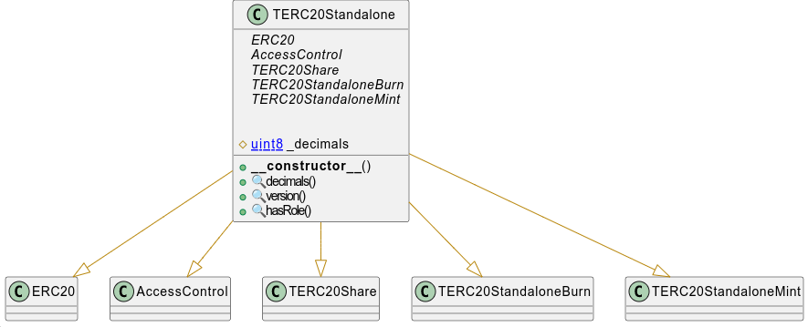

## TERC-20

[TOC]

This project contains two ERC-20 tokens:

- `TERC20Standalone` for an immutable deployment, without proxy
- `TERC20Upgradeable` for an upgradeable deployment, with a compatible proxy (Transparent or Beacon)

## Common characteristics

These ERC-20 tokens have the following characteristics:

**Mint**

- A *mint* function only accessible with the MINTER role


```solidity
mint(address,uint256)
```

- A *batchMint*  function only accessible with the MINTER role

```solidity
batchMint(address[],uint256[])
```

**Burn**

- A *burn* function only accessible with the BURNER role

```solidity
burn(address,uint256)
```

- A *batchBurn* function only accessible with the BURNER role

```solidity
batchBurn(address[],uint256[])
```

**ERC20**

- At deployment, the issuer can set the name, symbol and decimals.
- Once deployed, it is no longer possible to modify these values except via an upgrade in the case of the proxy.

## Access Control

There are three roles: MINTER_ROLE, BURNER_ROLE and DEFAULT_ADMIN_ROLE

The DEFAULT_ADMIN_ROLE has all the roles by default

## Schema

### TERC20Standalone

### UML



#### Inheritance


#### Graph


### TERC20 Upgradeable

#### UML


#### Inheritance


#### Graph


## Surya Description Report

### Contracts Description Table

#### TERC20Standalone

|       Contract       |       Type        |               Bases               |                |               |
| :------------------: | :---------------: | :-------------------------------: | :------------: | :-----------: |
|          └           | **Function Name** |          **Visibility**           | **Mutability** | **Modifiers** |
|                      |                   |                                   |                |               |
| **TERC20Standalone** |  Implementation   | ERC20, AccessControl, TERC20Share |                |               |
|          └           |   <Constructor>   |             Public ❗️              |       🛑        |     ERC20     |
|          └           |     decimals      |             Public ❗️              |                |      NO❗️      |
|          └           |      version      |             Public ❗️              |                |      NO❗️      |
|          └           |       mint        |             Public ❗️              |       🛑        |   onlyRole    |
|          └           |     batchMint     |             Public ❗️              |       🛑        |   onlyRole    |
|          └           |       burn        |             Public ❗️              |       🛑        |   onlyRole    |
|          └           |     batchBurn     |             Public ❗️              |       🛑        |   onlyRole    |
|          └           |      hasRole      |             Public ❗️              |                |      NO❗️      |

#### TERC20Upgradeable

|       Contract        |                Type                |                            Bases                             |                |                  |
| :-------------------: | :--------------------------------: | :----------------------------------------------------------: | :------------: | :--------------: |
|           └           |         **Function Name**          |                        **Visibility**                        | **Mutability** |  **Modifiers**   |
|                       |                                    |                                                              |                |                  |
| **TERC20Upgradeable** |           Implementation           | Initializable, ERC20Upgradeable, AccessControlUpgradeable, TERC20Share |                |                  |
|           └           |           <Constructor>            |                           Public ❗️                           |       🛑        |       NO❗️        |
|           └           |             initialize             |                           Public ❗️                           |       🛑        |   initializer    |
|           └           | __TERC20Upgradeable_init_unchained |                          Internal 🔒                          |       🛑        | onlyInitializing |
|           └           |              decimals              |                           Public ❗️                           |                |       NO❗️        |
|           └           |              version               |                           Public ❗️                           |                |       NO❗️        |
|           └           |                mint                |                           Public ❗️                           |       🛑        |     onlyRole     |
|           └           |             batchMint              |                           Public ❗️                           |       🛑        |     onlyRole     |
|           └           |                burn                |                           Public ❗️                           |       🛑        |     onlyRole     |
|           └           |             batchBurn              |                           Public ❗️                           |       🛑        |     onlyRole     |
|           └           |              hasRole               |                           Public ❗️                           |                |       NO❗️        |
|           └           |    _getTERC20UpgradeableStorage    |                          Private 🔐                           |                |                  |

### Legend

| Symbol | Meaning                   |
| :----: | ------------------------- |
|   🛑    | Function can modify state |
|   💵    | Function is payable       |


## Dependencies

The toolchain includes the following components, where the versions are the latest ones that we tested:

- Foundry
- Solidity 0.8.28 (via solc-js)
- OpenZeppelin Contracts (submodule) [v5.2.0](https://github.com/OpenZeppelin/openzeppelin-contracts/releases/tag/v5.2.0)
- OpenZeppelin Contracts upgradeable (submodule) [v5.2.0](https://github.com/OpenZeppelin/openzeppelin-contracts/releases/tag/v5.2.0)

## Audit

See [slither](./doc/audit/tool/slither-report.md)

## Tools

### Prettier

```bash
npx prettier --write --plugin=prettier-plugin-solidity 'src/**/*.sol'
```

```bash
npx prettier --write --plugin=prettier-plugin-solidity 'test/**/*.sol'
```

### Slither

See [crytic/slither]( https://github.com/crytic/slither)

```bash
slither .  --checklist --filter-paths "openzeppelin-contracts|test|forge-std" > slither-report.md
```

### Mythril

See [Consensys/mythril](https://github.com/Consensys/mythril)

```bash
myth analyze src/TERC20Standalone.sol --solc-json solc_setting.json
```

### Surya

See [./doc/script](./doc/script)

### Foundry

Foundry is a blazing fast, portable and modular toolkit for Ethereum application development written in Rust.

Foundry consists of:

-   **Forge**: Ethereum testing framework (like Hardhat).
-   **Cast**: Swiss army knife for interacting with EVM smart contracts, sending transactions and getting chain data.
-   **Anvil**: Local Ethereum node, akin to Ganache, Hardhat Network.
-   **Chisel**: Fast, utilitarian, and verbose solidity REPL.

## Usage

*Explain how it works.*


### Toolchain installation

The contracts are developed and tested with [Foundry](https://book.getfoundry.sh), a smart contract development toolchain.

To install the Foundry suite, please refer to the official instructions in the [Foundry book](https://book.getfoundry.sh/getting-started/installation).

### Initialization

You must first initialize the submodules, with

```
forge install
```

See also the command's [documentation](https://book.getfoundry.sh/reference/forge/forge-install).

Later you can update all the submodules with:

```
forge update
```

See also the command's [documentation](https://book.getfoundry.sh/reference/forge/forge-update).

### Compilation

The official documentation is available in the Foundry [website](https://book.getfoundry.sh/reference/forge/build-commands) 

```
 forge build
```

### Testing

You can run the tests with

```
forge test
```

To run a specific test, use

```
forge test --match-contract <contract name> --match-test <function name>
```

See also the test framework's [official documentation](https://book.getfoundry.sh/forge/tests), and that of the [test commands](https://book.getfoundry.sh/reference/forge/test-commands).

### Coverage

- Coverage v1.0.0


* Perform a code coverage

```
forge coverage
```

* Generate LCOV report

```
forge coverage --report lcov
```

- Generate `index.html`

```bash
forge coverage --ffi --report lcov && genhtml lcov.info --branch-coverage --output-dir coverage
```

See [Solidity Coverage in VS Code with Foundry](https://mirror.xyz/devanon.eth/RrDvKPnlD-pmpuW7hQeR5wWdVjklrpOgPCOA-PJkWFU) & [Foundry forge coverage](https://www.rareskills.io/post/foundry-forge-coverage)

### Documentation

[https://book.getfoundry.sh/](https://book.getfoundry.sh/)


## Intellectual property

The original code is copyright (c) Taurus 2025, and is released under [MIT license](https://github.com/taurushq-io/tg-bridge-contracts-CCIP/blob/main/LICENSE).
